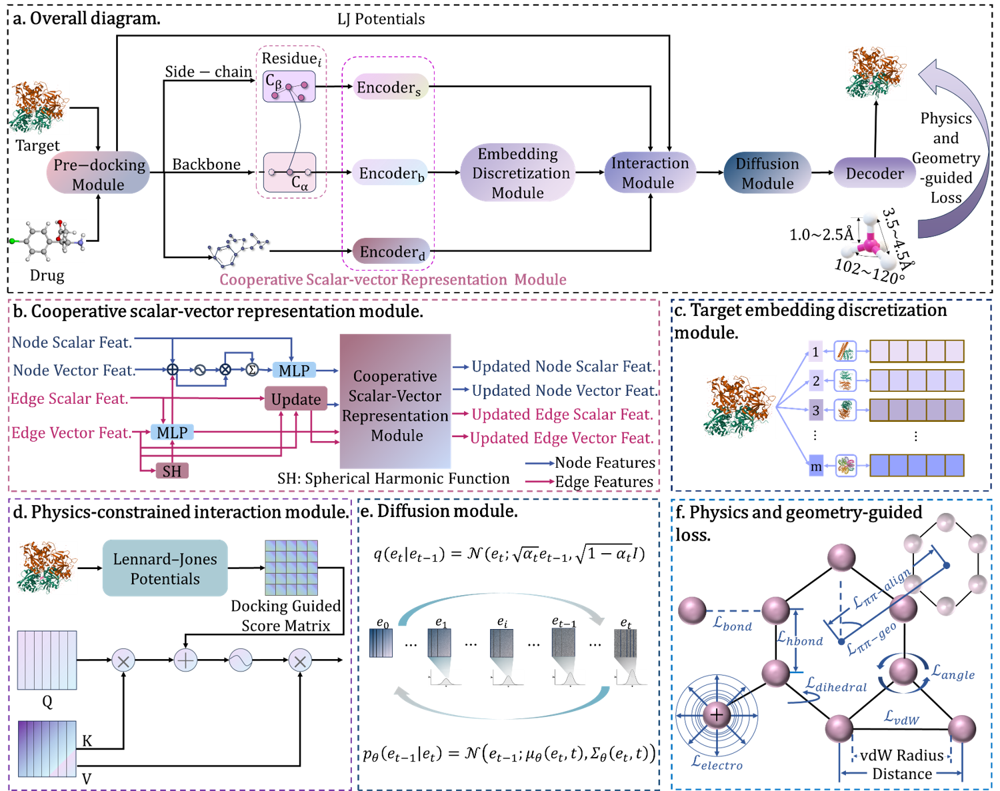

# DynaPhArM: Adaptive and Physics-Constrained Modeling for Target-Drug Complexes with Drug-Specific Adaptations

Accurately modeling the target-drug complex at atom level presents a significant challenge in the computer-aided drug design. Traditional methods that rely solely on rigid transformations often fail to capture the dynamic interactions between targets and drugs, particularly during substantial conformational changes in targets upon ligand binding, which becomes especially critical when learning target-drug interactions in drug design. Accurately modeling these changes is crucial for understanding target-drug interactions and improving drug efficacy.  To address these challenges, we introduce DynaPhArM, an SE(3)-Equivariant Transformer model specifically designed to capture dynamic alterations occurring within target-drug interactions. DynaPhArM utilizes the cooperative scalar-vector representation, drug-specific embeddings, and a diffusion process to effectively model the evolving dynamics of interactions between targets and drugs. Furthermore, we integrate physical information and energetic principles that maintain essential geometric constraints, such as bond lengths, bond angles, van der Waals forces (vdW), within a multi-task learning (MTL) framework to enhance accuracy. Experimental results demonstrate that DynaPhArM achieves state-of-the-art performance with an overall root mean square deviation (RMSD) of 2.01 Å and a sc-RMSD of 0.29 Å while exhibiting higher success rates compared to existing methodologies. Additionally, DynaPhArM shows promise in enhancing drug specificity, thereby simulating how targets adapt to various drugs through precise modeling of atomic-level interactions and conformational flexibility.

This repository contains the full implementation of the DynaPhArM framework, including all code for data preprocessing, model training, and evaluation.

  

## Key Features

-   **Hierarchical SE(3)-Equivariant Encoders**: Separately models the protein backbone, sidechains, and the ligand to capture features at different levels of granularity.
-   **Physics-Constrained Interaction**: A novel attention mechanism biased by pre-computed Lennard-Jones potentials guides the model to focus on physically plausible interactions.
-   **Diffusion-based Feature Refinement**: A diffusion model operating in the latent space refines the fused embeddings to capture multi-scale interaction patterns.
-   **Equivariant Structure Decoder**: A multi-layer graph transformer that translates latent features back into a physically plausible 3D structure.
-   **Multi-Objective Loss Function**: A comprehensive loss function that includes structural losses and physics-based geometric constraints (bond lengths, angles, van der Waals forces, etc.) to ensure the generation of realistic conformations.
-   **End-to-End Reproducible Pipeline**: Includes all scripts for data preparation, from raw PDB/SDF files to the final graph-structured data used for training.

## Installation

This project is developed using Python 3.8 and PyTorch. We recommend using a Conda environment to manage dependencies.

**1. Clone the Repository:**
```bash
git clone https://github.com/DiyaZhang6/DynaPhArM
cd DynaPhArM
```

**2. Create and Activate Conda Environment:**
```bash
conda create -n dynamodel_env python=3.8
conda activate dynamodel_env
```

**3. Install PyTorch and PyTorch Geometric:**

First, install PyTorch based on your system's CUDA version. Visit the [PyTorch official website](https://pytorch.org/get-started/locally/) to get the correct command. For example, for CUDA 11.8:
```bash
conda install pytorch torchvision torchaudio pytorch-cuda=11.8 -c pytorch -c nvidia
```

Next, install PyTorch Geometric, which is best done via Conda to ensure compatibility:
```bash
conda install pyg -c pyg
```

**4. Install Remaining Dependencies:**

The remaining Python packages are listed in `requirements.txt`.
```bash
pip install -r requirements.txt
```

**5. External Tool Dependencies:**

This project requires several external bioinformatics tools for the data preprocessing pipeline. Please install them and ensure their paths are correctly set in `config.yaml`.

-   **MGLTools**: Required for `prepare_receptor4.py` and `prepare_ligand4.py` to generate PDBQT files.
-   **AutoDock Vina**: Used for the initial docking step to generate `r_init`.
-   **CD-HIT**: Used for sequence clustering to create non-redundant training/validation splits.

After installation, update the absolute paths for these tools in `config.yaml` under the `mgltools`, `vina_settings`, and `dataset_split` sections.

## Data Preparation and Model Execution Pipeline

The entire workflow, from raw data to a trained model, is managed by a series of scripts. Please run them in the specified order. All parameters are controlled by `config.yaml`.

**Before you start:**
- Download the required raw datasets (e.g., PDBbind, CASF) and place them in the `data/` directory as specified in `config.yaml`.
- Verify all paths in `config.yaml` are correct for your system.

**Step 1: Prepare Protein and Ligand Files (PDB/SDF -> PDBQT)**
```bash
python data_processing/protein_pdbqt.py
python data_processing/drug_pdbqt.py
```

**Step 2: Initial Docking**
```bash
python data_processing/docking.py
```

**Step 3: Split Complexes into Components**
```bash
python data_processing/split.py
```

**Step 4: Generate Lennard-Jones Interaction Matrices**
```bash
python data_processing/LJ_generate.py
```

**Step 5: Create Graph Representations**
```bash
python data_processing/backbone_graph.py
python data_processing/sidechain_graph.py
python data_processing/drug_graph.py
```

**Step 6: Generate Final Labels**
```bash
python data_processing/phy_geo.py
```

**Step 7: Create Dataset Splits**
```bash
python data_processing/split_dataset.py
```

## Training the Model

Once the data preparation is complete, you can start training the model.

- **Configuration**: Adjust training hyperparameters like `batch_size`, `learning_rate`, and `epochs` in the `training` section of `config.yaml`.
- **Run Training**: Execute the training script from the project root directory.

```bash
python scripts/train.py
```

## Evaluating the Model

To evaluate a trained model, follow these steps:

1.  **Configure for Testing**: In `config.yaml`, update the `testing` section. 
2.  **Run Evaluation**: Execute the testing script. You can specify which test sets to run on in the config, or it will default to all sets defined in `data_loading.test_sets`.

```bash
python scripts/test.py
```

The script will output all structural and functional metrics, including RMSD values, success rates, and affinity prediction correlations.

## Citation

Zhang, D., Sun, M., Wang, X., Liang, C., Meng, Q., Ma, S., & Guo, F. DynaPhArM: Adaptive and Physics-Constrained Modeling for Target-Drug Complexes with Drug-Specific Adaptations. In The Thirty-ninth Annual Conference on Neural Information Processing Systems.

## License

This project is licensed under the [MIT License](LICENSE).

## Contact

For questions or bug reports, please open an issue on this GitHub repository.
